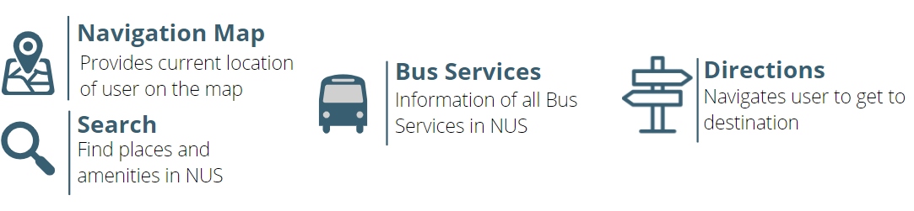
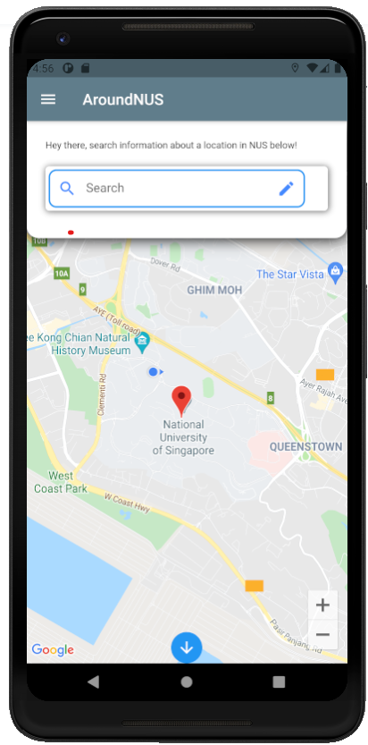
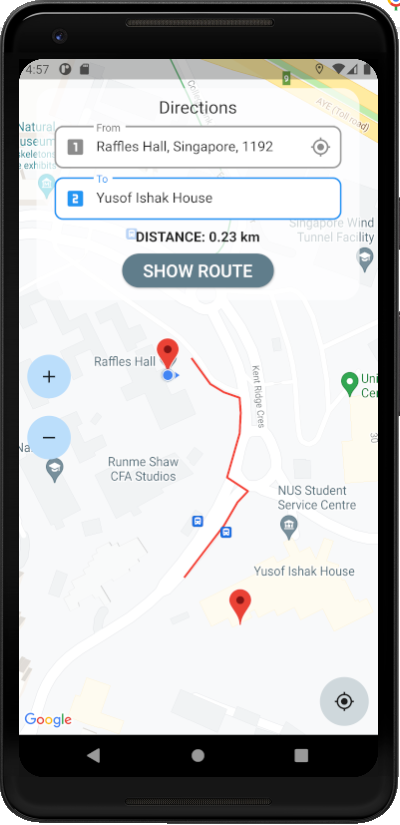
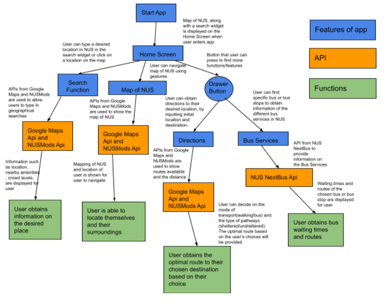

# AroundNUS: The fastest way to get around NUS

## Proposed Level of Achievement
Apollo 11

## TechStack
 

## Motivation
NUS students, including us, often find themselves having to use various platforms in the process of trying to get from one place to another in school. From using NUS Next Bus to first determine the bus to bring them to the nearest bus stop, then using google maps to find a way to walk to the building from the bus stop to the destination building. If they are unsure of the location of the room / lecture theatre, NUSMODS will then be employed to figure out where the room is before the student can get there. This is an extremely time consuming and inefficient process which we aim to solve through our app.

## Aim
Provide an all in one navigation app for NUS students to find their way around campus efficiently without having to cross - reference from different apps or websites 

## User Stories
1. As a user, I would be able to locate myself on campus, and be able to search for the location and information of a place in NUS. (eg. Technoedge, CLB)
2. As a user, I would be able to find out the bus routes and timings of the bus services available at the bus stops nearest to me.
3. As a user, I would be able to find the most efficient path from wherever I am to my destination location.

## Scope of Project
  

The navigation screen will provide a map interface using the Google Maps API for users to pinpoint their current location, as well as a search feature that will allow them to locate places and amenities in NUS, along with information about the place (eg. accessibility)

The bus screen using the NUS Next Bus API will provide bus timings of busses that are available at the bus stop they are currently at.

Finally, the most important directions feature which requires the Google Maps Routing API, together with NUS Next Bus API for bus routes, will allow users to input their starting and ending location and the app will provide detailed directions on the shortest path to get there.

### Map Screen and Directions Screen
  

Development Plan up to Milestone II:

By Mid June:
1. Search feature will suggest recent features searched by users; autocomplete feature
* Backend database storing recent entries input by user
2. Users able to save frequent / favourite destinations in Directions Screen 
* Backend database allowing users to save frequently travelled / favourite locations (postal code of buildings in Google Maps as initial implementation) 

By End June:
1. Path finding algorithm improved to locate specific tutorial rooms / lecture theatres / amenities 
* Integrate adjusted google maps routing API to account for NUS shuttle bus routes to get from initial location to bus stop closest to destination along with directions upon reaching building to get to desired location
2. Multiple path options
* Similar to google maps, multiple options of travel will be provided to the user, from walking, taking the bus or even a driving option. 

## Program Flow
 
